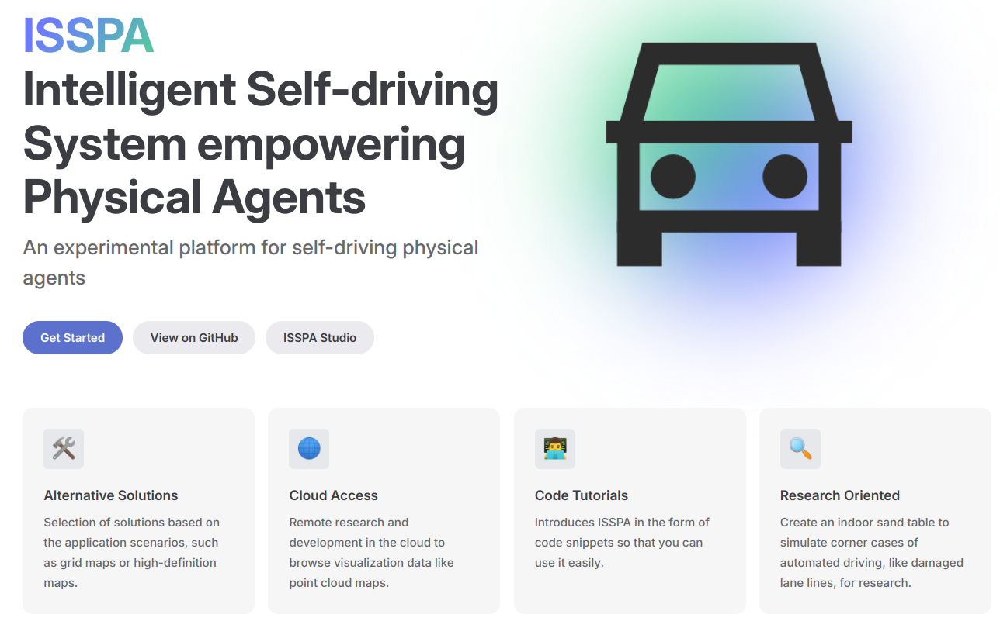

# Introduction

Here is an overview of our ISSPA project, which aims to build an easy-to-deploy and convenient-to-research tool. To achieve this purpose, we highlight four features as you can see in the picture.

More specifically, **ISSPA** is an experimental platform for autonomous physical agents, which was originally designed to 
facilitate researchers by creating baseline solutions that are easy to use. And it was built under the leadership of the [TIS Lab](https://tis.ios.ac.cn/), of which 
the team members are listed in [Team](https://isspa.readthedocs.io/en/latest/about_us/team.html).

# How to Use

Please read the [ISSPA Documentation](https://isspa.readthedocs.io/en/latest/) or [ISSPA of TIS Lab](https://tis.ios.ac.cn/isspa/) for more details.