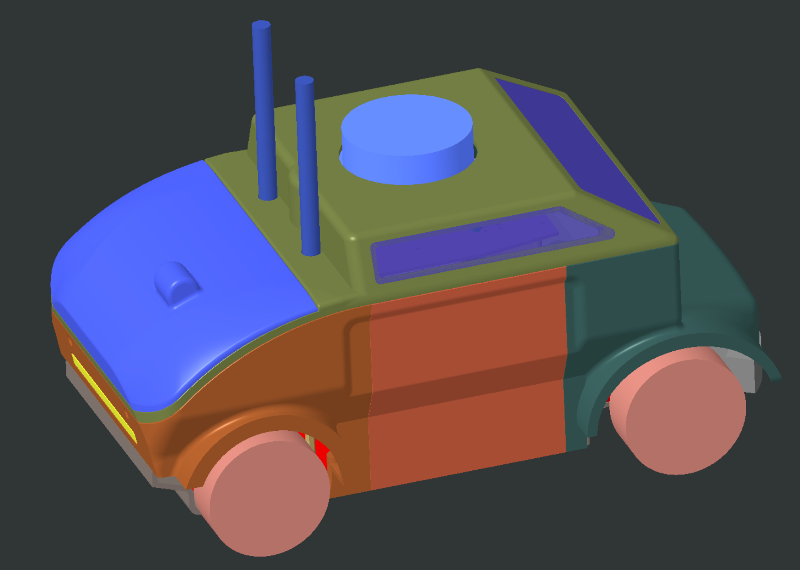
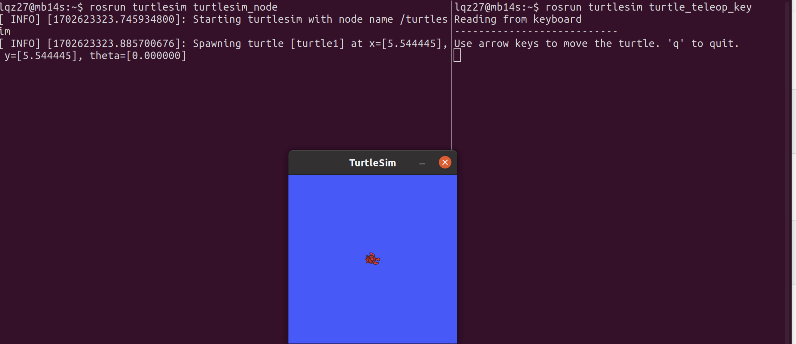

**PAVS User Manual**
====================

PAVS is an acronym for **Physical Agents Vehicle Small**, which is a small 
vehicle for indoor environments, and its basic use will be described in the 
following document.

- `Connection methods`_

- `Start the vehicle chassis and sensors`_

- `Start the SLAM program`_

- `Start the Navigation program`_

First, the model diagram of the vehicle is shown below:

   **Model Diagram of PAV-S**

Connection Methods
------------------

There are many ways to connect to a vehicle's internal port, such as through `VNC viewer`, 
`SSH`, `Jupyter Notebook`, etc., or connecting a monitor plugged into the vehicle will work.

When first familiarizing yourself with the vehicle software framework, we recommend that you use a 
monitor plugged into the on-board computing board (e.g., NVIDIA Computer's HDMI connector), which provides a 
visual interface for familiarizing yourself with the internal operating system.

.. note::
    Reserve at least one USB port for the keyboard and mouse kit, which can help you with wireless 
    network configuration and so on.

Once you have configured your network, you can view your IPv4 address via the ``ifconfig`` command. 
After that, you can connect via VNC viewer or SSH (we will use SSH as an example below).

The command line usage of SSH is as follows:

.. code-block:: bash

    ssh jetson@192.168.xx.xx

.. note::
    The default username is **jetson**, and the default password is **iscas**.

`Additionally, we prefer that you use VS code for SSH connections during this process.`

As soon as you have connected to the terminal inside the vehicle, you can start some programs 
to run the vehicle.

Multi-machine Communication
---------------------------

We elaborate on the implementation of multi-machine communication, 
particularly between a `Local Computer` (personal computer) and `PAVS` (Physical Agents Vehicle Small). 
For example, control instructions sent from the local terminal are received and executed by the vehicle.

Environments Description
________________________

Suppose the IP of your Local Computer and PAVS are as follows,

.. code-block:: bash

    192.168.1.27    # Local Computer
    192.168.1.101   # PAVS

Settings
________

We now describe how to set up multi-machine communication based on the above scenario.
The main idea is to define the master nodes and hostnames of the PAVS and the local computer.

**Set PAVS**

.. code-block:: bash

    export ROS_MASTER_URI=http://192.168.1.101:11311    # PAVS IP
    export ROS_HOSTNAME=192.168.1.101                   # PAVS IP

.. note::

    The `ROS_MASTER_URI` refers to the IP of **PAVS**, and also `ROS_HOSTNAME` uses the IP of **PAVS**.

**Set Local Computer**

.. code-block:: bash

    export ROS_MASTER_URI=http://192.168.1.101:11311    # PAVS IP
    export ROS_HOSTNAME=192.168.1.27                    # Local Computer IP

.. note::

    The `ROS_MASTER_URI` refers again to the IP of **PAVS**, but now the IP in `ROS_HOSTNAME` is the one of the **Local Computer**.

Validation
__________

We will verify the correctness of the settings described above and demonstrate the results of multi-machine communication.

**PAVS**

In the terminal of PAVS, run the following command.

.. code-block:: bash

    roscore

**Local computer**

In two terminals on the Local Computer, run the following commands.

.. code-block:: bash

    rosrun turtlesim turtlesim_node         # in a terminal
    rosrun turtlesim turtle_teleop_key      # in another terminal

Following the given commands, you'll be able to transmit commands from your Local Computer's keyboard 
through the roscore on the PAVS, and ultimately, 
have them received and executed by the turtle on the Local Computer, as depicted in the diagram below.

   **Multi Machine Communicate**

Start the Vehicle Chassis and Sensors
-------------------------------------

Firstly, launch chassis and sensors driver and sensors of the vehicle. 

.. code-block:: bash

    roslaunch pavs_bringup pavs_chassis_and_sensors.launch

With the chassis booted, you can view the current list of messages 
via the ``rostopic list``, e.g. ``/cmd_vel`` is the topic for which the chassis expects twist subscribers.

At this point, launch another terminal, again using SSH to connect to the vehicle, and enter the following 
commands to test that the motors and servos are working properly.

.. code-block:: bash

    rostopic pub /cmd_vel geometry_msgs/Twist "linear:
      x: 0.1
      y: 0.0
      z: 0.0
    angular:
      x: 0.0
      y: 0.0
      z: 0.5" -r 10

If the chassis was successfully activated, the vehicle should have moved forward and turn left by now.

.. note:: 

    The cordinate which ROS uses is right-handed, and the direction of the z-axis is upward. 
    Moreover, counterclockwise is the positive direction.

Start the SLAM Program
----------------------

After that, you can test if the SLAM program works properly.

.. code-block:: bash

    roslaunch mapping_baselines pavs_map.launch

When the program is started, you can check for message output by typing ``rostopic echo /map`` in the vehicle's 
terminal, which normally outputs a number of matrices containing decimal values between 0 and 1, which represent the probability 
of an obstacle being present in the grid.

The default SLAM algorithm is ``gmapping`` and you can conveniently switch between algorithms by passing arguments on the 
command line: for example, if you want to use ``cartographer``, you can use the following command:

.. code-block:: bash

    roslaunch mapping_baselines pavs_map.launch map_type:=cartographer

Further, you need to control the vehicle movement via a remote controller or a keyboard control node.

.. note::
    
    Warm reminder: Try not to let the vehicle hit the obstacles during mapping.

When the map is created, you can execute ``map.sh`` under the ``~/ISSPA/src/isspa_mapping/mapping_baselines/scripts`` directory
to save your map.

A quick way to search for this script is ``roscd``, used as follows:

.. code-block:: bash

    roscd mapping_baselines/scripts

Then execute the following command:

.. code-block:: bash

    ./map.sh

    # If you are using ``cartographer``, use ``cartographer_map.sh``
    ./cartographer_map.sh

Eventually, the maps will be saved to the ``~/ISSPA/src/isspa_mapping/mapping_baselines/maps/`` directory 
with the name `map`.

At this point, you will find the following two files:

.. code-block:: bash

    ISCAS@ISCAS:~/ISSPA/src/isspa_mapping/mapping_baselines/maps$ ll
    total 640
    drwxrwxr-x 2 chw chw   4096 1月  16 20:46 ./
    drwxrwxr-x 6 chw chw   4096 12月 19 16:37 ../
    -rw-rw-r-- 1 chw chw 640052 1月  16 20:46 map.pgm
    -rw-rw-r-- 1 chw chw    191 1月  16 20:46 map.yaml

where ``map.pgm`` is the grip map and ``map.yaml`` is the configuration file for the map.

Start the Navigation Program
----------------------------

Once you have activated the vehicle's chassis and sensors, and you have obtained a grid map, it is then 
possible to realize the task of fixed-point navigation!

.. code-block:: bash

    roslaunch navigation_stack pavs_navigation.launch

By now, you will be able to test the effectiveness of the navigation algorithms on ``RVIZ`` by selecting points on the 
map that are free of obstacles.

