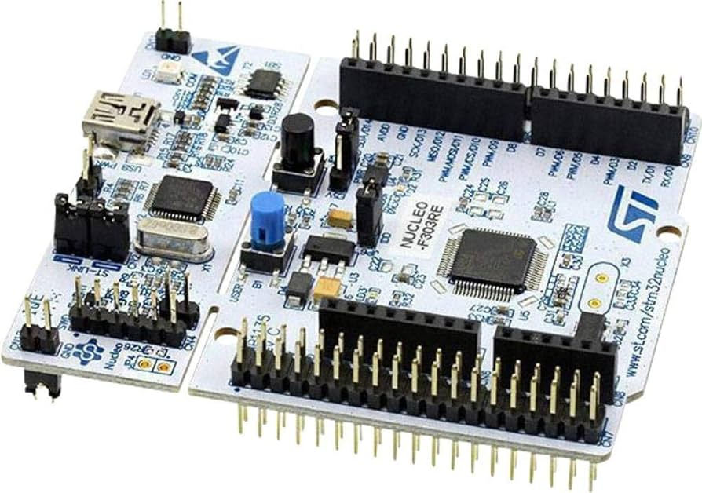
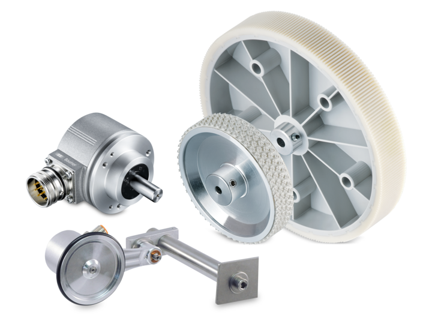
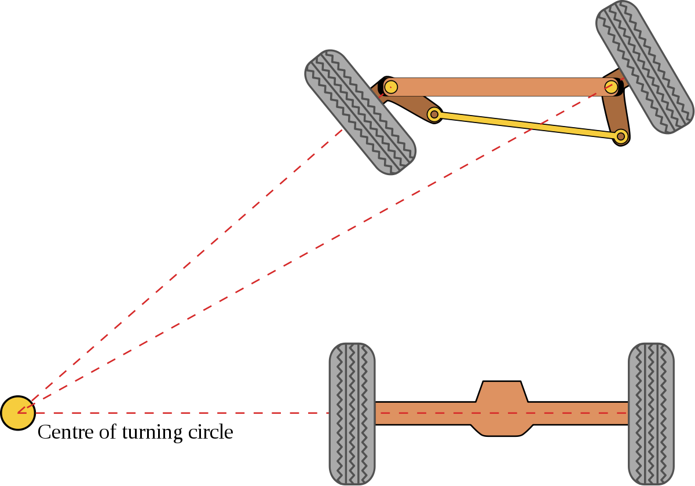

**Chassis**
===========

**Preface**
-----------

`ISSPA <https://github.com/iscas-tis/ISS-PA/>`_'s vehicle chassis primarily adopts the **Ackermann steering design**, 
where the front two wheels act as steering wheels controlled by a servo motor while traction is provided by the rear two 
wheels that serve as drive wheels controlled by motors. This configuration enables basic vehicle maneuvers, such as steering 
and forward and reverse movement. 

It is worth noting that some motors and servo motors are equipped with encoders, which record the 
wheel's rotation count and direction. Chassis motion data can be transmitted to a MicroController Unit (MCU), 
which typically provides communication interfaces such as USART, I2C, SPI, that are capable of receiving 
data and transmitting control signals (e.g., pulse signals). 

With an understanding of the chassis, one gains insights into the fundamental operations of ISSPA. 
In summary, information on the vehicle's motion status can be obtained from the chassis. 
It is essential to emphasize that acquiring vehicle status is crucial for tasks such as `digital twin`.

Modern automobiles generally employ the Ackermann steering design, akin to the chassis of autonomous vehicles. 
Therefore, we currently focus on the development of vehicles with Ackermann chassis. 
In addition to the Ackermann design, we plan to incorporate in ISSPA various chassis designs in future work, 
such as two-wheel differential drive, four-wheel differential drive, four-wheel steering, etc., 
to meet diverse research needs.

**MCU**
-------

   `STM32 example <https://www.amazon.sa/-/en/Nucleo-64-development-STM32F303RE-supports-connectivity/dp/B01N6EKDEF>`_

A MicroController Unit (MCU) is a miniature computer system that integrates a Central Processing Unit (CPU), memory (RAM and/or ROM), 
timers, and input/output ports. **STM32** is a series of 32-bit MCUs based on the ARM Cortex-M core, introduced by STMicroelectronics. 
It finds wide applications in embedded systems, IoT devices, industrial control systems, and particularly in smart cars.

In the context of intelligent vehicles, the roles of MCUs like STM32 include:

- Communication Interfaces: MCUs typically integrate various communication interfaces such as UART, SPI, I2C, etc., facilitating data 
  exchange with other devices, sensors, and communication modules. This enables real-time communication with external systems, 
  such as remote controllers and wireless networks.

- Motor Control: The MCU controls motor drivers, adjusting the speed and direction of the motors. By receiving sensor feedback and 
  executing control algorithms, e.g. **PID**, the MCU ensures that the vehicle travels along the intended path.

**Wheel Encoders**
------------------

   `Wheel Encoders example <https://www.baumer.com/us/en/product-overview/distance-measurement/measuring-wheel-encoders/c/292>`_

Wheel encoders in intelligent vehicles serve crucial functions in measuring and monitoring wheel motion, 
playing a significant role in applications such as odometry estimation, and precise positioning. 
Their main functions include:

- Speed and Direction Measurement: Wheel encoders measure the speed and direction of the vehicle by detecting 
  the rotation of the wheels. By monitoring the rotation of each wheel, the system can calculate the actual motion state of the vehicle.

- Precise Positioning: Wheel encoders provide precise displacement information relative to the 
  initial position of the vehicle. This is essential for navigation and positioning systems, especially 
  in applications like autonomous driving and unmanned vehicles that require high-precision location information.

- Closed-Loop Control: In closed-loop control systems, feedback from wheel encoders is used to 
  adjust the vehicle's motion, ensuring it travels along the predefined path and speed. This is crucial for achieving stable automatic control.

- Odometry Estimation: Wheel encoders can be used to estimate the mileage traveled by the vehicle. 
  This is valuable for long-distance travel and path planning, ensuring that the vehicle reaches its destination according to the planned route.

In summary, wheel encoders play a key role in smart cars, providing real-time information on position, speed, and direction. 
This enables precise navigation, control, and obstacle avoidance capabilities for the vehicle.

**Ackermann Steering**
----------------------

   `Ackermann Steering example <https://en.wikipedia.org/wiki/Ackermann_steering_geometry>`_

Ackermann steering is an engineering principle used in the design of vehicle steering systems, aiming to ensure that all wheels maintain a common
turning radius during turns. This design method adjusts the steering angles of the vehicle's wheels, allowing the inner wheels to turn 
more than the outer wheels to accommodate varying turning radii. This steering mechanism is widely employed in motor vehicles, 
particularly in cars and some heavy-duty vehicles.

- Common Turning Radius: The goal of Ackermann steering is to have all wheels share a common turning radius during turns, enhancing vehicle
  stability and driving control.

- Greater Steering Angle for Inner Wheels: During turns, Ackermann steering requires the inner wheels to have a larger steering angle than 
  the outer wheels. This is achieved through carefully designed tie rods and steering mechanisms.

- Optimized Driving Stability: Ackermann steering design helps reduce lateral slip during turns, enhancing overall driving stability and maneuverability, 
  especially during high-speed driving and sharp turns.

