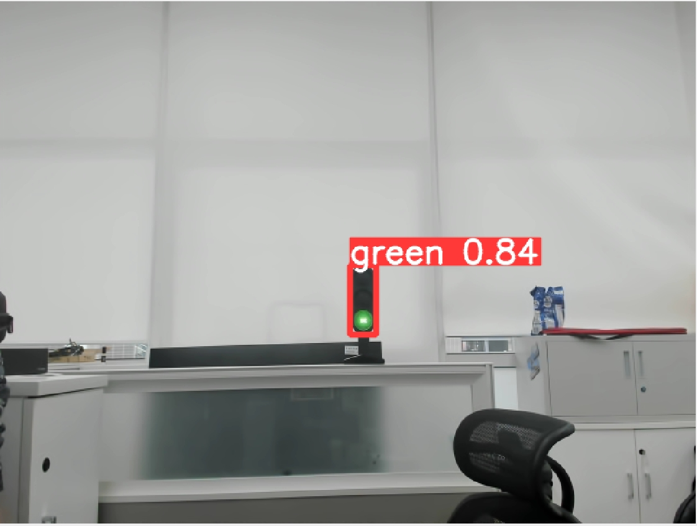
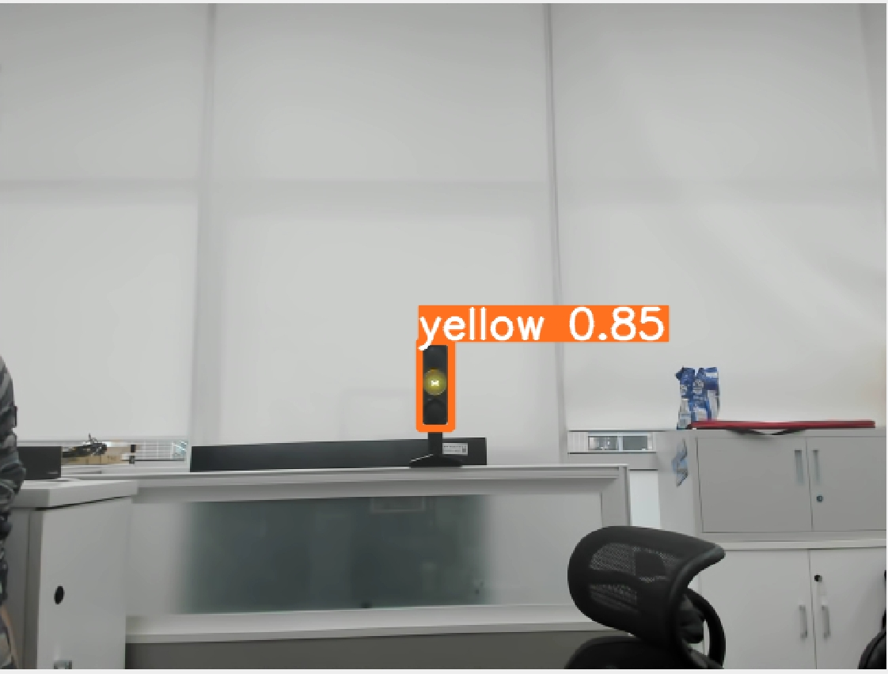

**Detection**
=============

Currently widely used sensing sensors in autonomous driving include LiDAR, cameras, radar, and event-based cameras (e.g., DVS).
Based on such sensors, we can implement tasks such as object detection algorithms, instance segmentation algorithms, 
and drivable area detection. In ISSPA, we categorize detection tasks based on the type of sensor:

- `Camera based`_

- `LiDAR based`_

- `Fusion based`_

.. _`Camera based`:

**Camera Based**
----------------

Traffic Light Recognition
~~~~~~~~~~~~~~~~~~~~~~~~~

In the domain of autonomous driving, the recognition of traffic signal lights holds pivotal importance. This capability involves 
the vehicle system identifying and comprehending the status of traffic signals, including red, green, and yellow lights.

In ISSPA, we trained a classifier based on `yolov5`_ that can recognize the color of traffic lights with the following results:

   **Traffic light recognition results based on yolov5 (green)**

   **Traffic light recognition results based on yolov5 (yellow)**

.. _`Lidar based`:

**Lidar Based**
---------------

Lidar plays a critical role in autonomous driving due to its high precision, real-time scanning capability, 360-degree perception, 
and adaptability to diverse environmental conditions. As a key sensor, Lidar contributes significantly to the safe and reliable 
operation of autonomous vehicles.

.. note::

    The PointPillars algorithm has been tested in ISSPA and will be synchronized to the code repository as soon as possible.

.. _`Fusion based`:

**Fusion Based**
----------------

The fusion approach mainly combines data from multiple sensors, such as cameras and lidar, to take advantage of their strengths and 
reduce their weaknesses.

**Reference**
-------------

- `yolov5 <https://github.com/ultralytics/yolov5>`_