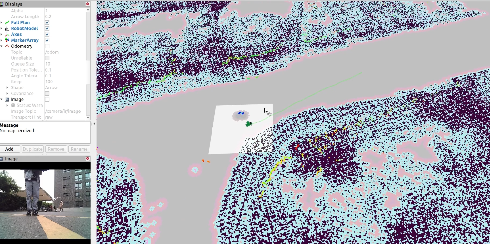

**Mapping**
===========

**Preface**
-----------

An accurate representation of the surrounding environment significantly aids the operation of 
autonomous vehicles. There are various ways to represent the environment, such as 
through 2D grid maps, Bird's Eye View (BEV), 3D point cloud, topological maps, HD Maps, and more.

Different levels of autonomous driving functionalities can flexibly choose the appropriate map representation. 
Each type of map has its own merits. For instance, grid maps require a small storage space and are easy to create, 
but they lack semantic information like lane markings. On the other hand, high-definition maps, 
while rich in content, require continuous updates, and as the geographical area increases, production costs also escalate.

As ISSPA currently operates primarily within the `ISCAS <http://english.is.cas.cn/>`_ (Institute of Software Chinese Academy of Sciences) 
campus, it predominantly utilizes grid maps. 
These maps can be obtained through methods such as 2D SLAM, 3D SLAM, and several well-established SLAM 
approaches are available, including GMapping, Cartographer, etc. Below are some demonstration results.

**Grid Map**
------------

The following is the result of grid map generation within the ISCAS campus.

   **Grid Map example**

Grid map is one representation of the environment used in the field of autonomous driving. It divides the surroundings into regular grid cells, 
with each cell representing a small area on the map. This type of map is commonly employed to depict the vehicle's surroundings, facilitating 
various functionalities of autonomous driving systems such as perception, decision-making, and path planning.

Grid maps are particularly useful for modeling the environment in a structured manner. Each cell in the grid can store information about the state 
or characteristics of the corresponding area, allowing the autonomous vehicle to understand and navigate its surroundings. This representation is 
often employed for sensor fusion, where data from various sensors, such as lidar, radar, and cameras, can be integrated and interpreted within the grid cells.

Moreover, the grid map provides a convenient framework for processing and analyzing spatial information, aiding in tasks such as obstacle detection, 
localization, and route planning. Its regular structure and ability to store heterogeneous data make it a valuable tool for enhancing the perception 
and decision-making capabilities of autonomous vehicles.