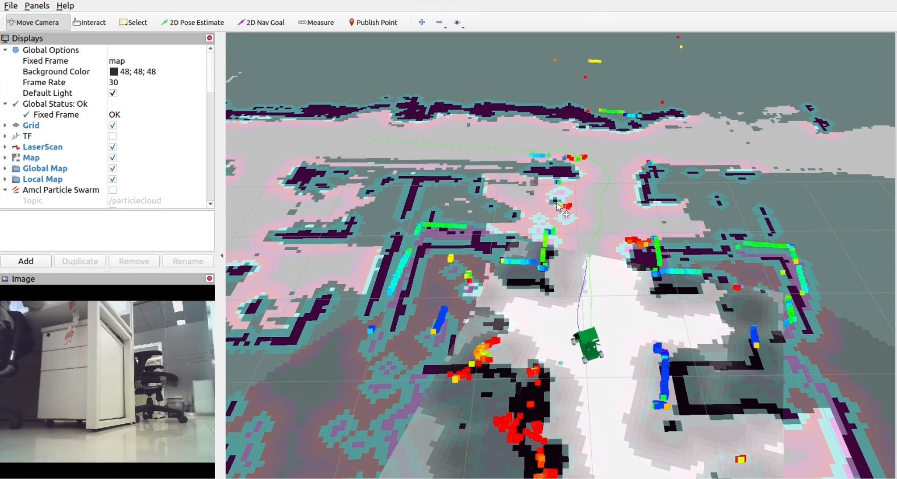

**Navigation**
==============

**Preface**
-----------

The navigation module is a key part of self-driving vehicles, guiding the vehicle from one point to another. It has 
important tasks like figuring out the best overall route (global path planning), planning short-term moves (local path planning), 
and controlling how the vehicle actually moves.

For the navigation module to work, it gets information like where the vehicle is (localization) and detailed maps. Then, it 
decides on important details, like how fast the vehicle should go and how it should turn. These decisions are then sent to the 
control module, which makes the vehicle move accordingly.

In practical terms, the planning part of the navigation module has two jobs. First, the global path planning decides the 
best way to go from where the vehicle is to where it needs to be, like choosing the sequence of roads to use. 
Second, the local planning comes up with short-term plans 
for the vehicle to follow in real-time, especially when there are unexpected things in the way, such as lanes being temporarily 
closed or occupied by slow vehicles. 

Within the field of control systems, mature algorithms such as PID (Proportional-Integral-Derivative) and LQR (Linear Quadratic Regulator) 
have reached an advanced stage of development. In PAV-S, the implementation of PID control has been integrated and embedded into an MCU 
control board to ensure responsiveness and meet real-time operational requirements.

**List of Navigation Algorithms**
---------------------------------

ISSPA has deployed one or several benchmark algorithms for both planning and control tasks within the Navigation module. 
For planning, it predominantly relies on the technology path provided by the ROS Navigation stack, 
while the control aspect incorporates the classic PID control algorithm flashed onto the development board.

Here is the algorithmic breakdown for each task implementation:

+----------------------+----------------------+----------------+
|      Planning (ROS Navigation Stack)        |     Control    |
+======================+======================+================+
|     Global Planner   |     Local Planner    |       PID      |
+----------------------+----------------------+----------------+
|          A*          |         TEB          |       ...      |
+----------------------+----------------------+----------------+
|          D*          |         DWA          |       ...      |
+----------------------+----------------------+----------------+
|          PSO         |         ...          |       ...      |
+----------------------+----------------------+----------------+

In the following parts, we will discuss in more details these tasks.

**Planning**
------------

ISSPA employs the ROS navigation stack to execute Planning tasks.
The ROS Navigation Stack is a comprehensive planning framework in robotic research, serving as a sophisticated navigation solution. 
Comprising an array of algorithms and modules, it empowers robots to autonomously traverse their environment while avoiding obstacles. 
This stack incorporates fundamental components such as localization, mapping, and path planning, providing a holistic solution for 
robotic navigation challenges. In essence, it serves as a cornerstone in the realm of robotic systems, facilitating intelligent 
and adaptive movement in complex surroundings.

In the ISSPA framework, we employ a set of foundational algorithms, encompassing both baseline methods and advanced global and 
local planning strategies. Notable global planning algorithms like D* and A* are utilized to delineate optimal routes, 
while local planning algorithms such as TEB and DWA contribute to nuanced and adaptive trajectory planning. 
To enhance user-friendliness, each algorithm is accompanied by its dedicated parameter file, simplifying the process of swiftly optimizing parameters.

   **Indoor Navigation example**

The figure above shows a test of the navigation algorithm in a lab environment, where the green line is the trajectory generated by 
the global planning algorithm (D*), the blue line shows the trajectory generated by the local planning algorithm (TEB), and 
the colored dots in the neighborhood of the vehicle are the return points of the 3D LiDAR.

**Control**
-----------

Within the control module, we seamlessly integrate the Proportional-Integral-Derivative (PID) algorithm into the MicroController Unit (MCU). 
The PID algorithm, renowned for its classical simplicity and ease of implementation, takes center stage in governing the control dynamics 
of the system. This classical control approach within the MCU ensures stability and precision in steering the system's behavior, establishing 
a robust and accessible control architecture.

.. figure:: ../imgs/PID_wiki.png
   :alt: PID block diagram 
   :align: center
   :scale: 30%

   `PID block diagram <https://en.wikipedia.org/wiki/Proportional%E2%80%93integral%E2%80%93derivative_controller>`_

The figure shows the block diagram of a PID controller in a feedback loop, 
where :math:`r(t)` is the desired process variable (PV) or setpoint (SP), and :math:`y(t)` is the measured PV.

In ISSPA, the PID control variable can encompass :guilabel:`angular velocity`, :guilabel:`linear velocity`, etc.

**Inputs & Outputs**
--------------------

Within this section, we aim to present the inputs and outputs of different planning and control algorithms. 
This endeavor is intended to offer you a comprehensive reference and insight into these algorithms.

+----------------------+----------------------+---------------------------------------------+----------------------------------------------+
|         Algo         |         Type         |              Inputs                         |                  Outputs                     |
+======================+======================+=============================================+==============================================+
|     A* / D* / PSO    |     Global Planner   |        a. Start and goal positions          |         Planned global path (route)          |
|                      |                      |        b. Map information                   |                                              |
+----------------------+----------------------+---------------------------------------------+----------------------------------------------+
|      DWA / TEB       |     Local Planner    |     a. Global path                          |    a. Planned local trajectory               |
|                      |                      |     b. Map information                      |    b. Linear velocity and angular velocity   |
|                      |                      |     c. Robot's dynamics and Constraints     |                                              |
+----------------------+----------------------+---------------------------------------------+----------------------------------------------+
|          PID         |     Controller       |     a. Expected linear and angular velocity |      a. Motor speed control: PWM value       |
|                      |                      |     b. Current linear and angular velocity  |      b. Yaw control: Angular velocity        |
+----------------------+----------------------+---------------------------------------------+----------------------------------------------+

**Global Planner**
##################

In the ROS Navigation Stack, the D* (D-star) and A* (A-star) algorithms are primarily used for global path planning. 

Their inputs generally involve:
   - **Start and goal positions** -- Which describe the robot's initial position (coordinates) and the target destination it intends to reach. 
   
   - **Map information** -- Typically represented as a grid map or similar format indicating traversable areas, obstacles, and other terrain information in the robot's environment.  

Their outputs generally involve:
   - **Planned global path (route)** -- The primary output consists of a computed path from the starting point to the goal location, 
     accounting for the map information and obstacle avoidance strategies implemented by these algorithms.

**Local Planner**
#################

In the ROS Navigation Stack, the TEB and DWA algorithms are primarily used for local trajectory planning. 

Their inputs generally involve:
   - **Planned global path** -- Path or trajectory obtained from the global planner.
   - **Local map information** -- Typically represented as a local grid map.
   - **Robot's kinematic and dynamic constraints** -- Information about the vehicle's physical limits, e.g., maximum speed, acceleration, and other kinematic constraints.
 
Their outputs generally involve:
   - **Planned local trajectory** -- Trajectory that considering the dynamic constraints and local map information, ensures collision avoidance and kinematic feasibility.
   - **Vehicle linear and angular velocity** -- Velocity commands that are sent to the control task to control the vehicle.

**Controller**
##############

In control tasks, PID is a classical method.

Its inputs are:
   - **Expected vehicle linear and angular velocity** -- Vehicle linear and angular velocity as provided by the :guilabel:`local planner`.

   - **Current vehicle linear and angular velocity**.
     
Its outputs are:
   - **Motor speed control** -- PWM value.

   - **Yaw control** -- Angular velocity. 

**Reference**
-------------

- `ros navigation stack ROS wiki <https://wiki.ros.org/navigation>`_.

- `move_base ROS wiki <https://wiki.ros.org/move_base>`_.

- `global_planner ROS wiki <https://wiki.ros.org/global_planner>`_.

- `PSO_global_planner <https://github.com/JZX-MY/pso_global_planner>`_.

- `dwa_local_planner ROS wiki <https://wiki.ros.org/dwa_local_planner>`_.

- `teb_local_planner ROS wiki <https://wiki.ros.org/teb_local_planner>`_.

- `PID wiki <https://en.wikipedia.org/wiki/Proportional%E2%80%93integral%E2%80%93derivative_controller>`_.
