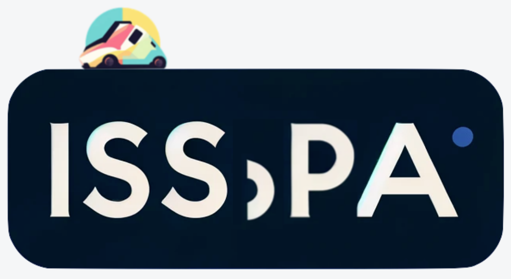
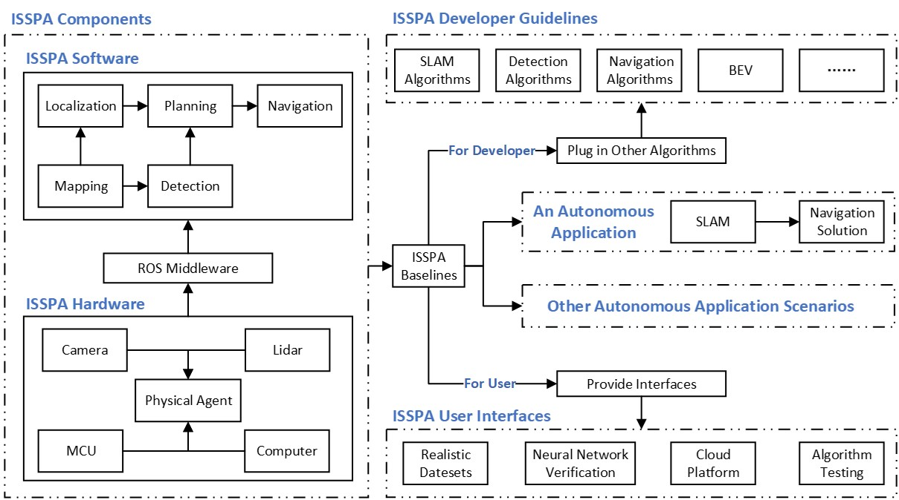

.. toctree::
   :maxdepth: 1
   :caption: HOME 

.. toctree::
   :maxdepth: 1
   :caption: TUTORIALS
   :hidden:

   /tutorial/quick_start
   /tutorial/user_manual_collection

.. toctree::
   :maxdepth: 1
   :caption: CONTRIBUTING TO ISSPA
   :hidden:

   /contributing_to_isspa/mapping_plugin.rst
   /contributing_to_isspa/navigation_plugin.rst
   /contributing_to_isspa/object_detection_plugin.rst

.. toctree::
   :maxdepth: 1
   :caption: ISSPA COMPONENTS
   :hidden:

   /components/chassis
   /components/sensors
   /components/mapping
   /components/navigation
   /components/detection
   /components/segmentation

.. toctree::
   :maxdepth: 1
   :caption: ISSPA APPENDIX
   :hidden:

   /appendix/pavs_user_manual
   /appendix/isspa_library
   /appendix/compilation_tools
   /appendix/issue_and_troubleshooting

.. toctree::
   :maxdepth: 1
   :caption: ABOUT US
   :hidden:

   /about_us/team.rst

.. meta::
   :description lang=en: ISSPA, the Intelligent Self-driving System empowering Physical Agents.

ISSPA Documentation
===================

Welcome to the `ISSPA <https://github.com/iscas-tis/ISS-PA>`_ documentation!
---------------------------------------------------------------------------------

   **Logo of ISSPA (Intelligent Self-driving System empowering Physical Agents)**

**ISSPA (Intelligent Self-driving System empowering Physical Agents)** is an experimental platform for 
self-driving physical agents, which was originally designed to facilitate researchers by creating
baseline solutions that are easy to use, algorithmically verifiable, and modularly extensible. 
It is developed under the leadership of the `TIS Lab <https://tis.ios.ac.cn/>`_, of which the team members 
are listed in :doc:`/about_us/team`.

.. note::

   The ISSPA project is a branch of the `ISS <https://tis.ios.ac.cn/iss/>`_ project.

ISSPA architecture
~~~~~~~~~~~~~~~~~~

   **ISSPA architecture**

The architecture of ISSPA is shown above. 
ISSPA follows a hierarchical and modular architecture, which provides a clear structure for developing 
intelligent self-driving systems where single components can be easily added, improved, and extended to 
meet specific needs.

Among others, ISSPA provides the following features:

- A collection of baseline solutions for autonomous driving.
- Cloud platform that supports the remote use of physical vehicles.

TUTORIALS
---------

Here are some guidelines for you to get started:

- :doc:`/tutorial/quick_start` - Understand the developing environment and how programs are launched.

- :doc:`/tutorial/user_manual_collection` - User manual collection for ISSPA.

ISSPA COMPONENTS
----------------

Introduction to the core elements of ISSPA.

- :doc:`/components/chassis` - Descibes what ISSPA's vehicle chassis is, and how to get vehicle's state.
  
- :doc:`/components/sensors` - Describe the sensors used by ISSPA, e.g., camera, lidar, imu.
  
- :doc:`/components/mapping` - The dominant algorithm for SLAM, the baseline algorithm, is introduced.
  
- :doc:`/components/navigation` - Navigation frameworks and classical planning algorithms are presented.
  
- :doc:`/components/detection` - Introduction to object detection tasks, and common baseline algorithms such as yolov5.

- :doc:`/components/segmentation` - Introduction to instance segmentation tasks, and common baseline algorithms such as LSS.

ISSPA APPENDIX
--------------

Documents such as user manuals (e.g. PAV-S) are categorized.

- :doc:`/appendix/pavs_user_manual` - User manual for PAV-S (Physical Agent Vehicle Small).

- :doc:`/appendix/isspa_library` - ISSPA's ROS library for Python and C++.

- :doc:`/appendix/compilation_tools` - Introduction to the compilation tools used in ROS.

- :doc:`/appendix/issue_and_troubleshooting` - Common issues and solutions.

CONTRIBUTING TO ISSPA
---------------------

Guide you on how to add plugins to ISSPA, if you have a better solution and are willing to contribute to this project, 
please do not hesitate to ``Pull & Request`` on `Github: ISSPA <https://github.com/iscas-tis/ISS-PA/>`_.

.. image:: ./imgs/github_mark.png
   :target: https://github.com/iscas-tis/ISS-PA/
   :alt: GitHub Repository
   :align: center
   :width: 20%

- :doc:`/contributing_to_isspa/mapping_plugin` - Extended guidance on SLAM algorithms is available here.
  
- :doc:`/contributing_to_isspa/navigation_plugin` - Extended guidance on navigation algorithms is available here.
  
- :doc:`/contributing_to_isspa/object_detection_plugin` - Extended guidance on object detection algorithms is available here.

ABOUT US
--------

- :doc:`/about_us/team` - Presentation of our team and corresponding achievements, e.g. paper publications.
