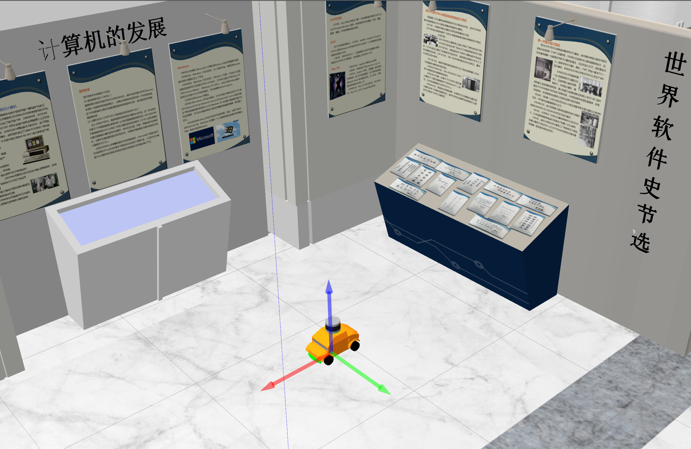

# Car-like Robot Simulation in Gazebo
This repository hosts Gazebo simulations for small size car-like robots. This simulation environment is a part the [ISS Platform](https://tis.ios.ac.cn/iss/).




## Installation
**The code is tested on ROS Noetic and Ubuntu 20.04.**
Firstly, install all the dependencies:
```
sudo apt-get install ros-noetic-navigation ros-noetic-gmapping ros-noetic-teb-local-planner ros-noetic-ackermann-msgs ros-noetic-gazebo-ros-pkgs ros-noetic-gazebo-ros-control ros-noetic-joint-state-publisher-gui
```

Then install this package:
```
mkdir -p ~/catkin_ws/src && cd ~/catkin_ws/src
git clone --recurse-submodules <this repo>
cd ~/catkin_ws && catkin_make
source ~/catkin_ws/devel/setup.bash
```

## Usage
Try the robot in Gazebo:
```
roslaunch robot_gazebo try_robot_sim.launch robot_name:=pav_s00 world:=ROS-Academy
```
Try SLAM & navigation using [ROS navigation stack](http://wiki.ros.org/navigation):
```
roslaunch robot_gazebo try_slam_nav.launch robot_name:=pav_s01 world:=ROS-Academy
```

## Acknowledgement
- [ackermann_gazebo](https://github.com/Lord-Z/ackermann_gazebo)
- [velodyne_simulator](https://github.com/lmark1/velodyne_simulator)
- [ros academy](https://github.com/sychaichangkun/ROS-Academy-for-Beginners)
